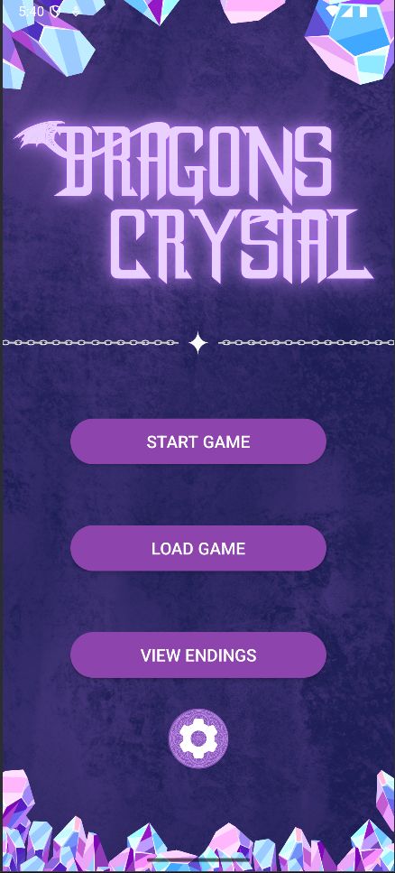

# The Dragon’s Crystal

!

## 📑 Table of Contents
1. [Overview](#overview)
2. [About](#about-the-dragons-crystal)
3. [Features](#features)
4. [Demo](#demo)
5. [Getting Started](#getting-started)
    - [Requirements](#requirements)
    - [Installation and Running](#installation-and-running)
        - [From Android Studio](#from-android-studio)
        - [From CLI & Sideload](#from-cli--sideload)
6. [Usage](#usage)
7. [Known Issues & Roadmap](#known-issues-roadmap)

## 🌟 Overview
…

2. [About](#about-the-dragons-crystal)

**The Dragon’s Crystal** Embark on an adventure, appointed by the King of a medieval fantasy world, to take back the Queen’s precious gem in this fantasy choose your own adventure game. Make your own choices to see where your adventure leads you. Will you find the gem and return it, or will your adventure have something different in store? Use the save button to save your progress, so that you can return to that point at any time. Try to find all the endings and use the endings screen to keep track of them. Boundless entertainment awaits!

- **Platform:** Android
- **Languages:** Java, Kotlin
- **Engine / IDE:** Android Studio
- **Prototype:** Adobe XD
- **Collaboration & Versioning:** GitHub, Discord, Google Docs

## About The Dragons Crystal
Its significance is to provide entertainment and alleviate boredom and users will gain a replenished sense of adventure. We wanted to have a choose your own adventure game in the palm of anyone's hands.

## Features

- **Branching Story Paths**  
  Choose from two options at each step to carve your personal narrative.

- **Save & Resume**  
  Tap the purple **Save** button to bookmark your current state.  
  An **Auto-Save** slot preserves progress whenever you make a choice.

- **Endings Gallery**  
  Unlock and view each ending (good, bad, or “you’ve died!”) in the **Endings** screen.

- **Global Meta-Progression**  
  Deaths and endings you’ve reached stay unlocked across play-throughs.


## Demo

[Watch the Project Demo →](https://www.youtube.com/watch?si=KybFcqEu4sY0MmNH&v=q5pOa39VVqs&feature=youtu.be)

## Getting Started

## Requirements

- Android Studio Bumblebee or later
- Android SDK Platform 30+
- An Android device or emulator running Android 6.0+

## Installation and Running

### From Android Studio

1. **Clone** the repo
   ```bash
   git clone https://github.com/yourorg/the-dragons-crystal.git
   cd TheDragonsCrystal
   ```
2. **Open** in Android Studio
3. **Run** on your device or emulator.
    Studio will build a debug APK and deploy it automatically.

### From CLI & Sideload

1. Build and debug APK:
    ```bash
   cd TheDragonsCrystal
   ./gradlew assembleDebug
   ```
2. **Install** on your connected device via ADB:
 ```bash
adb install -r app/build/outputs/apk/debug/app-debug.apk
 ```
3. **Launch** the app from your device's app drawer.
> **Tip:** to create a signed release APK, use
> `./gradlew assembleRelease` or  
> **Build → Generate Signed Bundle / APK…** in Studio.

## Usage

1. **Start** your adventure at the Main Menu.
2. **Make choices** on each page; use the **Save** button to pick slot 1–3.
3. **If you die** or reach an ending, you’ll see a dialog offering to **restart and save** (preserving global progress) or return to the Main Menu.
4. **View Endings** from the Main Menu to explore the flowchart.
    - Discovered pages show their ID
    - Undiscovered branches show “?”
5. **Pinch-zoom** and **pan** to navigate large charts.

## Known Issues & Roadmap

- **Endings view** currently only reads slot 1
- **Flowchart** edge‐routing could be improved (no intersections)
- **Planned:**
    - Add Portuguese localization
    - More story branches / DLC
    - Unit & UI tests  

    


